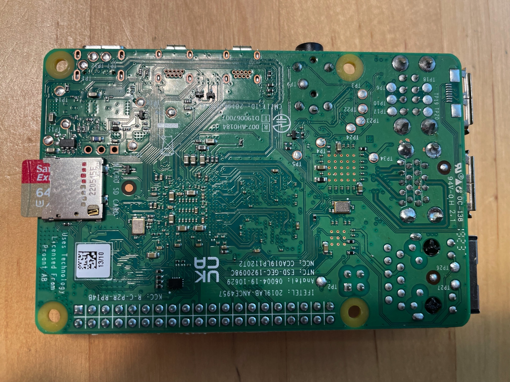
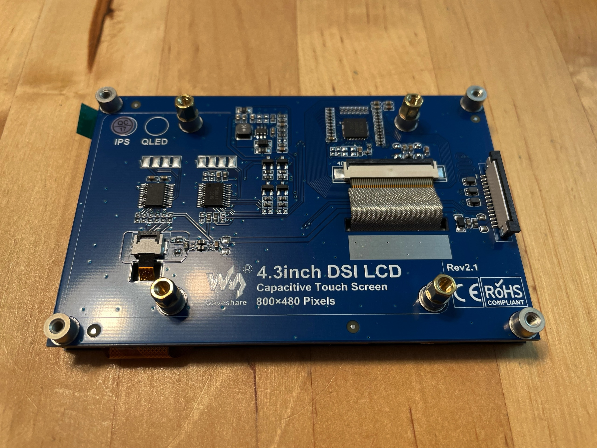
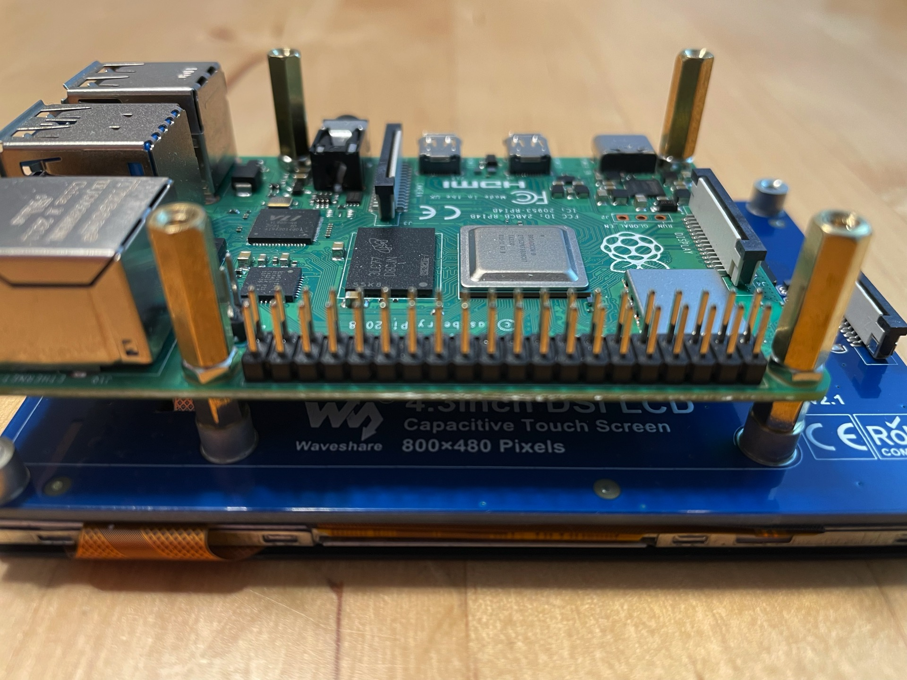
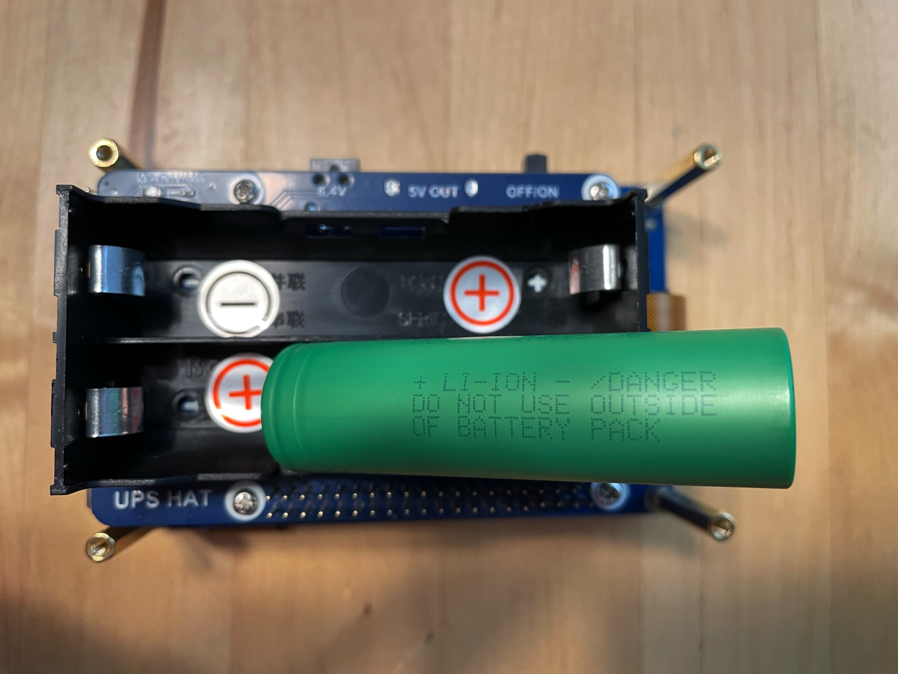
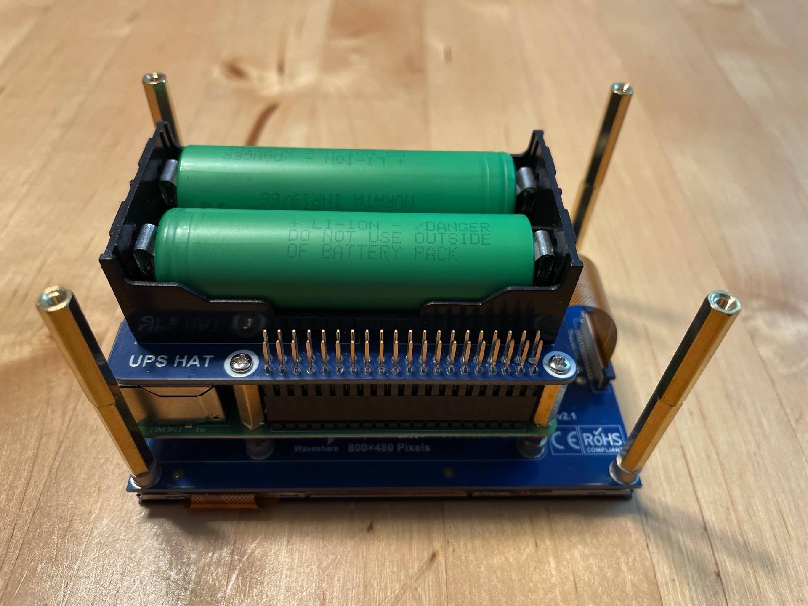
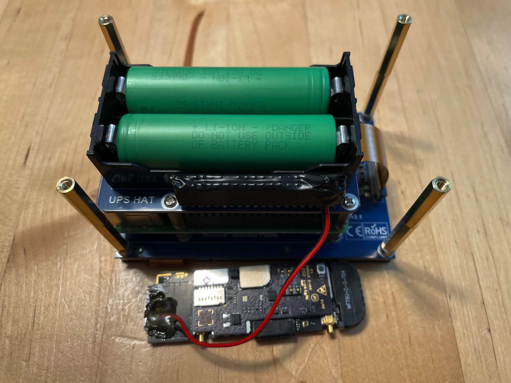
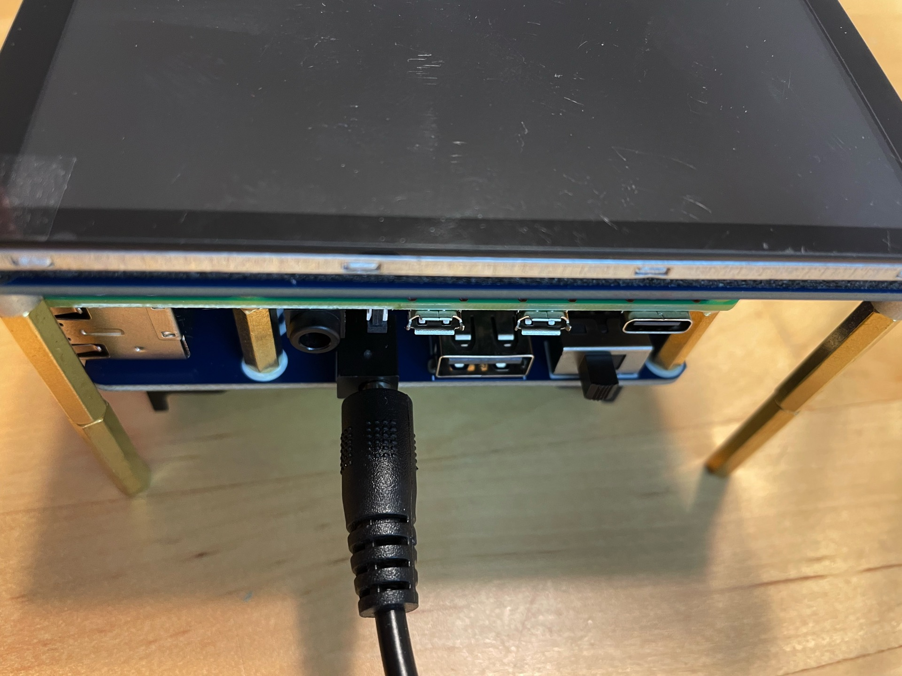
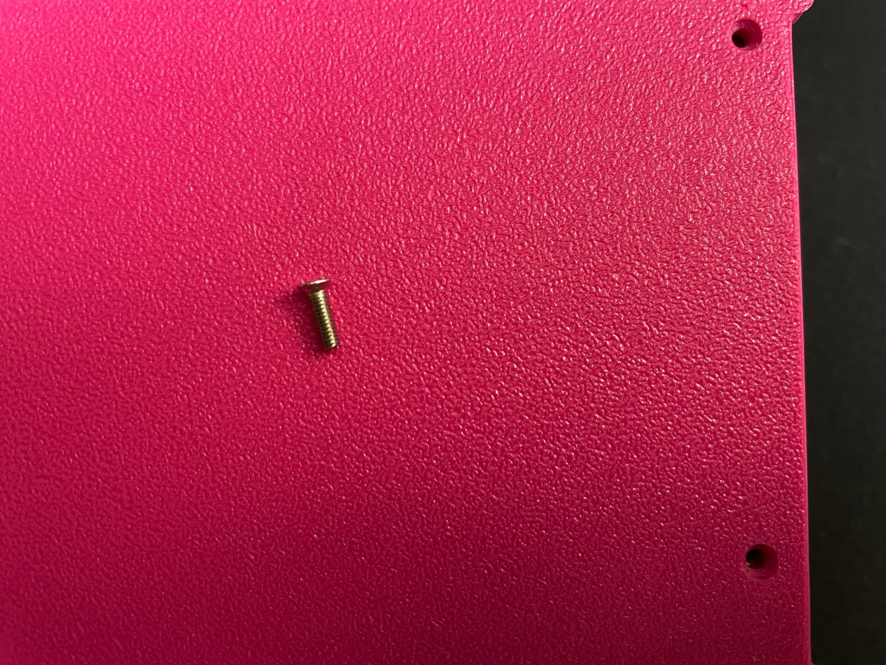

# T-Pot Mobile

The idea for T-Pot Mobile started a couple of years back when T-Pot started to support the ARM64 architecture. Raspberry Pi hardware was hard to come by at reasonable prices so the journey took a little longer than anticipated. Started as a one-day-a-month project at work, it fastly turned into a weekend / evening project (winter was coming) and the first version was done in [December](https://www.linkedin.com/posts/mochse_telekomsecurity-cyberdefense-raspberrypi-activity-7138560366661300224-Ccra).<br><br>
While already being an eye catcher the display was not bright enough, the resistive touchpanel and the resolution really did limit the possibilities. In consequence a new display had to be found that helped overcome the drawbacks. The Waveshare 4.3" capacitive display was great choice with a higher resolution.<br><br>
The case had to redesigned and the code had to be adjusted to work with a capacitive display. Quickly it was decided to make this available for everyone (once [T-Pot 24.04](https://github.com/telekom-security/tpotce) was released).<br><br>
I am very happy to share this project as Open Source, with a huge thanks to [Telekom Security](https://geschaeftskunden.telekom.de/digitale-loesungen/cyber-security) to make this possible. Cannot wait to see your prints, spins and forks!


# Table of Contents
<!-- TOC -->
* [T-Pot Mobile](#t-pot-mobile)
  * [Hardware requirements](#hardware-requirements)
  * [Requirements](#requirements)
  * [Installation](#installation)
    * [One liner installation](#one-liner-installation)
    * [Manual installation](#manual-installation)
  * [LTE Stick settings](#lte-stick-settings)
  * [Usage](#usage)
    * [Turn on](#turn-on)
    * [Turn off](#turn-off)
  * [T-Pot Mobile GUI](#t-pot-mobile-gui)
    * [Waiting for Elasticsearch](#waiting-for-elasticsearch)
    * [Event Mode](#event-mode)
    * [Open Dialog Box](#open-dialog-box)
      * [Cancel](#cancel)
      * [Map / Stats](#map--stats)
      * [Reboot](#reboot)
      * [Power Off](#power-off)
  * [Maintenance and Troubleshooting](#maintenance-and-troubleshooting)
    * [Connect a keyboard](#connect-a-keyboard)
    * [Exit the GUI](#exit-the-gui)
    * [Starting / Stopping T-Pot services](#starting--stopping-t-pot-services)
    * [Cronjob](#cronjob)
    * [Updates](#updates)
    * [Network Settings](#network-settings)
  * [3d Print Settings](#3d-print-settings)
  * [Assembling the parts](#assembling-the-parts)
  * [Licenses](#licenses)
<!-- TOC -->

## Hardware requirements

T-Pot Mobile is developed specifically to make T-Pot a tangible, fully wireless honeypot supporting the following hardware components:
- [Raspberry Pi 4 model B](https://www.raspberrypi.com/products/raspberry-pi-4-model-b/) with 8GB of RAM, 64GB microSD card
- [Waveshare 4.3" touch display](https://www.waveshare.com/wiki/4.3inch_DSI_LCD), make sure to order the version including the [case](https://www.amazon.de/dp/B08LH5MFVS)
- [Waveshare UPS HAT](https://www.waveshare.com/wiki/UPS_HAT) with 2 * 18650 batteries
- [ZTE MF79U Wingle CAT4-4G](https://www.amazon.de/gp/product/B08WPXRTRL) with the USB plug removed
- [Nuts and standoff assortment](https://www.amazon.de/gp/product/B08M3BVC9Q) 
- Regarding the hardware limits of the Raspberry Pi4 platform (mainly RAM and storage) T-Pot Mobile will use a `docker-compose.yml` specifically adjusted for this use case.

The GUI has been developed using Pygame (Raspbian / Debian Bookworm is fully supported and required).<br>


## Requirements

- Raspbian Lite, 64bit based on Raspbian / Debian Bookworm
- At least T-Pot 24.04.0 which will be installed by the T-Pot Mobile installer
- Prepare the microSD Card with a user i.e. `tsec` and the WiFi settings for your local network (adjustments of the Wifi settings are described [here](#network-settings))

## Installation

### One liner installation
`env bash -c "$(curl -sL https://github.com/telekom-security/tpotmobile/raw/main/install.sh)"`

### Manual installation
Boot the machine, SSH into Raspbian on `tcp/22`, run the following commands and follow the installer:
```
sudo apt install git
git clone https://github.com/telekom-security/tpotmobile
cd tpotmobile
bash install.sh
```

The `install.sh` script will also install T-Pot. When the installer asks for a T-Pot type, please choose `(M)obile` in order to download the correct docker images.

Then `sudo reboot` the machine, please notice after the reboot SSH will only be available via `tcp/64295`.

It takes about 8 minutes until all services are started successfully after installation.

## LTE Stick settings
- Login: Factory default, adjust after setup
- SSID: Factory default, adjust after setup
- PSK: Factory default, adjust after setup
- For Telekom in Germany: Setup the LTE stick to use [APN with NAT Type 2](https://telekomhilft.telekom.de/t5/Mobilfunk/NAT-Typ-amp-APN-Einstellungen/td-p/3295081): `internet.t-d1.de`.
- Use NAT forwarding only for ports 1-64000 to avoid exposing T-Pot management ports, such as SSH.
- For DHCP / MAC settings ensure that the same IP will always be assigned to the T-Pot Wifi Adapter or NAT will break once a new IP lease starts.

## Usage
### Turn on
- After turning the device on (UPS HAT power switch in on-position) the device will automatically boot and wait for the mobile network / WiFi to be fully enabled.
- It takes roughly 8-10 minutes until all services have been started, then the first events should trickle in.
### Turn off
- After [Shutting Down](#power-off) the device can be turned off (UPS HAT power switch in off-position). Always shutdown the device first to avoid damaging the elasticsearch index and / or filesystem.

## T-Pot Mobile GUI
### Waiting for Elasticsearch
- Once the device has started the GUI will wait for Elasticsearch to be available, afterwards the GUI will switch into event mode (default: Last 1h). The GUI can be fully utilized once events have been written to the Elasticsearch index.
### Event Mode
- A single touch will switch between the event modes (Last 1m, 15m, 1h, 24h).
### Open Dialog Box
- Swiping up from the bottom of the screen towards the top of the screen (at least half the height of the screen) will open the dialog box.
#### Cancel
- Will exit the dialog box. 
#### Map / Stats
- While in Stats mode the button will be called "Map" and when pressed will open the Map mode.
- While in Map mode the button will be called "Stats" and when pressed will open the Stats mode.
#### Reboot
- The Reboot button will reboot the system. 
#### Power Off
- The Power Off button will shut down the system. The system is designed for 24/7 operation, however it needs to be turned off using the Power Off function to avoid damaging the file system or elastic search indices. 

## Maintenance and Troubleshooting
### Connect a keyboard
- For troubleshooting you can connect a keyboard.
### Exit the GUI
- Press `q` to exit the GUI.
- Login to the system with your username, i.e. `tsec` and the password you chose.
- You now have access to the console as with any other Raspbian / Debian installation.
### Starting / Stopping T-Pot services
- In `/etc/systemd/system` are the T-Pot systemd service files `tpot.service` and `tpotdisplay.service` located. While `tpot.service` does control the T-Pot services `tpotdisplay.service` controls the T-Pot Mobile GUI.
- Start T-Pot: `sudo systemctl start tpot.service`
- Start T-Pot Mobile GUI: `sudo systemctl start tpotdisplay.service`
- Stop T-Pot: `sudo systemctl stop tpot.service`
- Stop T-Pot Mobile GUI: `sudo systemctl stop tpotdisplay.service`
### Cronjob
- T-Pot Mobile will restart the device by default every day. You can change the cronjob settings with `sudo crontab -e`.
### Updates
- While OS updates will be installed automatically the docker image pull policy is set to `missing`. This means even if newer image versions are available `docker compose` will not pull them. If your mobile connection is perfectly fine with downloading large docker image files then you can adjust `TPOT_PULL_POLICY` in `tpotce/.env` to `always`. Otherwise install updates using a different network connection i.e. LAN / WiFi.
- Update tpotce: `cd tpotce && sudo systemctl stop tpot && git pull`
- Update tpotmobile: `cd tpotmobile && sudo systemctl stop tpotdisplay && git pull`
- Update docker images: `cd tpotce && docker compose -f docker-compose.yml pull`
### Network Settings
- Raspbian uses Network Manager by default.
- You can find and adjust network connections in `/etc/NetworkManager/system-connections`.
- By default you will find `preconfigured.nmconnection` which contains the settings provided by Raspberry Pi Imager.

## 3d Print Settings
For 3d printing we were using PLA+ filament with the following settings, depending on your usage other filament types need to be considered i.e. PETG, ABS or ASA (those remain untested regarding the case). While the support settings will complicate the removal of the supports it improves not only the print quality but also in better layer adhesion for the supports.
- #### Layers and perimeters
  - Layer height 0,2mm
  - 8 solid base layers
  - 8 solid top layers
  - 6 perimeters for vertical shells
- #### Infill
  - 100%
  - Ironing enabled on the topmost surface only (you can leave this out, looks better enabled though)
- #### Supports enabled
    - Style: Snug
    - Top / bottom contact Z distance: 0.1
    - Sheath around the support enabled
    - Pattern: Rectilinear
    - Pattern angle: 45°
    - Top / bottom interface layers: 2
    - Interface Pattern: Rectilinear

## Assembling the parts
#### 
Make sure you ordered the display including the case, this will provide you with most of the required assembly parts, otherwise the case will not fit.

#### 
Place the display face down


#### 
Insert the microSD card into the Pi4, **after** installing Raspbian. It will be harder to reach the microSD card later in the process.


#### 
Screw the smallest standoffs in (included in the display / case package).


#### 
Align the Raspberry Pi on the standoffs and use the nuts (4 x M2.5) and standoffs (4 x M2.5 + 6) from the assortment to secure it.



#### 
Insert the flex DSI cable and ensure the cable and socket connectors align and the pins face each other.


####
Now screw the standoffs with the short end into the remaining four threads of the display backplate.


#### 
Install the UPS HAT on top of the Pi4 and secure it with the four phillips-head screws.


####
Add the remaining standoffs.


####
Insert the batteries and be careful about polarity.





#### 
If you are using the LTE stick you have probably soldered the power connectors to a stacking HAT. You can now place it on top of the UPS HAT.


####
Now is a good time to test everything before putting it into the case. Connect the power supply to the UPS HAT and switch the UPS HAT on.


#### 
Now put the LTE stick back into its case, insert the SIM card (which at this point should be setup not to require a PIN) and slide the LTE stick into its casket of the 3d printed case.

####
Slide the components carefully into the case and make sure not to damage the ribbon cable of the display.


#### 
Hold the display in place and turn the case upside down to secure the standoffs in the case using the Phillips-head screws.


#### 
Done. Now connect the power supply (barrel connector) and turn the UPS HAT on. Depending on your usage the UPS HAT will only fully charge the batteries if the USB-C power supply for the Pi4 is connected as well.


## Credits
- Thanks to everyone who gave their feedback and thus leading the project to v2!
- Thanks to [Thomas Tschersich](https://www.linkedin.com/in/thomas-tschersich/) and [Thomas Breitbach](https://www.linkedin.com/in/dr-thomas-breitbach-34a519159/) who have T-Pot Mobile always readily available for our customers at [Telekom-Security](https://geschaeftskunden.telekom.de/digitale-loesungen/cyber-security).

## Licenses
- Flags are provided by [Flagpedia](https://flagpedia.net).
- Display dtbo and ina219 module are provided by [Waveshare](https://www.waveshare.com), all copyrights apply.
- DTS overlays are provided by [RaspberryPi](https://github.com/raspberrypi/linux?tab=License-1-ov-file#readme).
